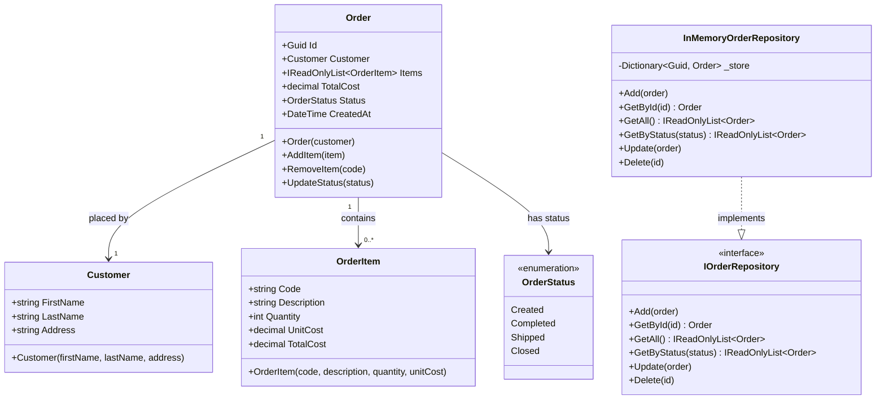

# MyAmazingApp

A simple .NET console application that demonstrates a basic order-management domain using an in-memory repository pattern.

## Goal

The project showcases how to model a small e-commerce domain in C# by combining:

- **Domain models** – `Customer`, `Order`, `OrderItem`, and the `OrderStatus` enum that together capture the lifecycle of a purchase.
- **Repository pattern** – the `IOrderRepository` interface and its `InMemoryOrderRepository` implementation provide a clean abstraction over data storage, making it straightforward to swap in a database-backed implementation later.
- **Console driver** – `Program.cs` exercises the full CRUD surface of the repository (add, update, query by status, look up by id, and delete).

## Class Diagram

